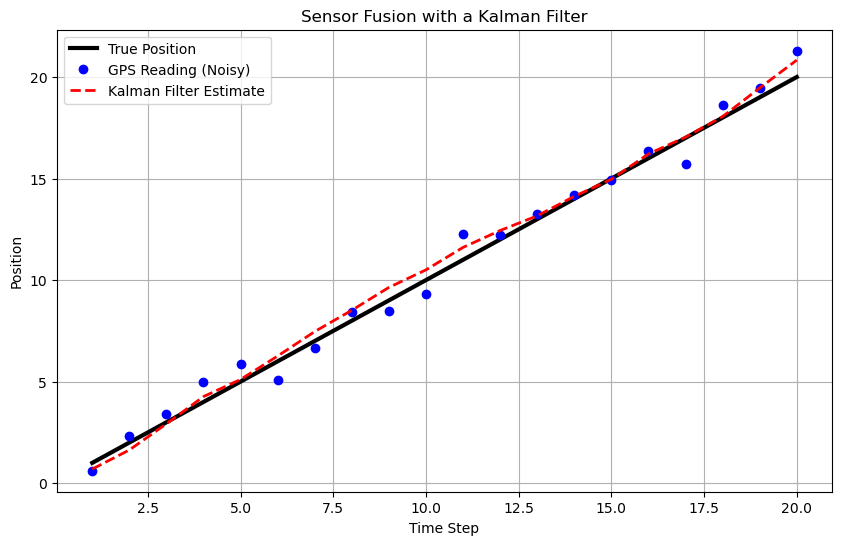

A classic example of sensor fusion is combining data from a GPS sensor and an accelerometer to track the position of a vehicle. 
A GPS provides an absolute position, but its signal can be noisy and slow to update.
An accelerometer, on the other hand, measures acceleration very quickly and accurately over short periods, but its measurements are prone to drift over time.
By fusing the two, you can get a system that has the long-term accuracy of the GPS and the short-term precision of the accelerometer.

